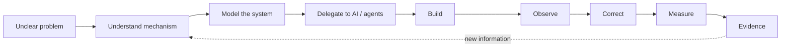
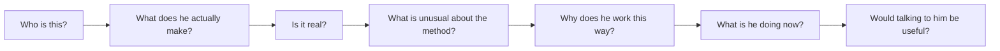
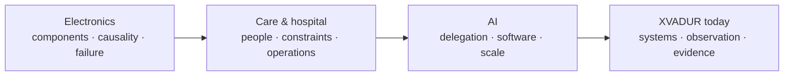

# XVADUR.com: Designing a Public Model of Adam Rudavský

## Executive synthesis

The brief contains the correct strategic premise: **the product of xvadur.com is not “AI consulting”; the product is an accurate, inspectable understanding of Adam Rudavský/XVADUR, with a conversation as the natural next action.** fileciteturn0file0

That changes almost every conventional portfolio decision.

A normal portfolio asks: *What work should I show?*  
A normal consultant site asks: *What service should I sell?*  
A normal personal site asks: *What should I say about myself?*

XVADUR should instead answer:

> **What is the smallest coherent model of this person that lets a stranger predict how he thinks, what he can build, whether his claims are credible, and whether speaking with him would be useful?**

The best contemporary precedents do not solve this by putting everything on the homepage. Derek Sivers uses radically compressed identity followed by progressively deeper context and a `/now` layer; Andy Matuschak separates a comprehensible public identity from a much larger body of working notes; Pieter Levels exposes a longitudinal record of shipped, failed, active and abandoned projects; Simon Willison turns years of technical work into durable, navigable knowledge structures; Brian Lovin treats the personal site as a multidimensional representation rather than a résumé; and Lee Robinson demonstrates an especially relevant pattern for AI work: quantitative AI-development telemetry becomes compelling when it is attached to a concrete artifact, testing, benchmarks and something visitors can actually run. citeturn3search2turn0search1turn1search10turn2search10turn7search17turn7search8

The resulting architecture should therefore have **two layers**:

**The guided model.** The homepage gives a stranger a deliberately edited, roughly one-to-three-minute path from identity → evidence → method → context → current work → conversation.

**The evidence graph.** Work, Method, Research, Now and About let a motivated visitor keep unfolding individual claims until they reach live products, datasets, code, methodology, test traces, source material or explicit provenance.

This is essentially progressive disclosure applied to a person. Nielsen Norman Group's guidance is directly relevant: users need strong information scent, the high-level view should contain what most people need, and advanced/detail-heavy material should be available without burdening everybody with it. citeturn6search0turn6search2

### The core recommendation

**Build the “Public Operating System” concept.**

Not a literal terminal. Not a cyberpunk dashboard. Not a life-logging spectacle.

It should feel like a **living, evidence-bearing interface to one operator**:

> **xvadur.com is an evidence-linked public model of Adam Rudavský: what he is building, how he reasons and works with AI, and the artifacts that let you verify it.**

That is the one-sentence explanation of what the website is.

The primary positioning should be:

> **Adam is an AI-native systems builder who turns unclear problems into working systems that can be inspected, measured and improved.**

The secondary positioning layers then explain *why that statement is unusual*:

| Layer | Function |
|---|---|
| **Systems builder** | What he actually does: workflows, software, agents, data systems, web products and operational infrastructure. |
| **AI-native operator** | How he does it: AI is integrated into decomposition, research, delegation, implementation, observation and iteration rather than used only as a chat interface. |
| **Evidence-oriented builder** | How visitors should decide whether to believe him: artifacts, datasets, methods, testing, telemetry and source trails. |
| **Technical + care-system background** | Why his mental model differs: electronics contributes systems/failure-mode thinking; healthcare contributes exposure to people, ambiguity, constraints and real operations. |
| **Independent research/operator layer** | Why some projects do not fit “client work”: he also constructs datasets, experiments, media/research systems and personal infrastructure. |
| **Consultation interface** | The commercial endpoint: somebody can bring an actual situation rather than first selecting a packaged service. |

The important word there is **secondary**. “Former hospital worker becomes AI builder” is a powerful explanatory layer, but a weak primary category. It tells the visitor where Adam came from before it tells them what he can do now.

### What I would change first on the existing site

The current public xvadur.com is already unusually close to the intended philosophy. It shows numerical project evidence, concrete systems, interactive material, a work model, research datasets and a consultation route rather than merely making abstract claims. The current homepage publicly lists, among other things, a realtor system with a 47-item pre-launch control set, Netopier with newsroom/person/transcript/corpus counts, Hriech, a senior-services dataset, personal telemetry and an agent/skills system. citeturn11search0

Its problem is therefore **not lack of substance**. My inference from the current site is that the raw material is one editorial layer short of becoming intelligible to an outsider. Too many things compete to define Adam simultaneously. citeturn11search0

The current “DIVIDED, WE ARE USELESS” opening is memorable, but it asks a first-time visitor to decode a thesis before they have acquired a model of the person. The many quantified artifacts below it demonstrate extraordinary output, but simultaneous numbers from unrelated systems make the visitor perform the classification work. The site presently behaves more like a fascinating lab bench than a guided public model. citeturn11search0

That rawness should **not** be designed away. It should be put behind a better lens.

The strongest decisions would be:

| Keep | Change |
|---|---|
| Real project numbers | Move most numbers from identity-level proof to project-level proof |
| Interactive artifacts | Make each interaction answer a specific claim |
| “Show the work” philosophy | Build a consistent claim → evidence → provenance language |
| Current consultation concept | Surface it contextually from projects and Method |
| Build numbers, timestamps, system state | Keep as metadata rather than main spectacle |
| Research/data work | Give it its own intelligible category |
| Personal history | Reframe it causally rather than autobiographically |
| Rich archive | Push the long tail one layer below the homepage |

The most important conceptual change is:

> **Do not make the visitor infer Adam from the archive. Give them the model first; let the archive falsify or deepen it.**

## Benchmark research

I reviewed the relevant mechanisms rather than simply looking for visually similar portfolios. The useful references fall into a few recurring families: compressed identity, public notebooks, project histories, living activity pages, artifact-first technical work, playful/interactive explanation, and personal sites that function as complete intellectual environments.

### Benchmark set

The table below contains more than the requested twenty references. “Borrow” means borrow the mechanism, not the aesthetic.

| Reference | Mechanism relevant to XVADUR | What to borrow |
|---|---|---|
| **Derek Sivers** | His homepage moves from a very compressed “me in 10 seconds” model into a longer version, current state, writing, books and projects. His `/now` concept explicitly answers what someone is focused on at the moment. citeturn3search2turn3search4turn3search6 | **Progressive identity resolution.** Give people the 10-second Adam before exposing the 10-year Adam. |
| **Andy Matuschak** | Presents himself around a clear research problem and organizes projects around it, while the working-notes environment exposes a much messier intellectual substrate. citeturn0search1turn0search0 | **Front door + deep research substrate.** The homepage does not need to resemble the archive. |
| **Pieter Levels** | Maintains a longitudinal project record that includes successful, failed, inactive and new projects, rather than retrospectively pretending everything worked. citeturn1search10 | **Visible project state and failure history.** Builds credibility because reality is not flattened into case-study propaganda. |
| **Lee Robinson** | His AI-built `pixo` case study connects hundreds of agent runs and hundreds of millions of tokens to cost, test coverage, benchmarks and an executable artifact. citeturn7search8 | **Telemetry attached to outcome and quality.** The best direct precedent for Korpus-style evidence. |
| **Simon Willison** | Combines an expert identity with a large, dated archive, project history, thematic series, TILs and current technical exploration. citeturn2search12turn2search10turn2search11 | **A durable topic architecture that can absorb years of output without making the homepage the archive.** |
| **Maggie Appleton** | Uses a concise multidisciplinary identity and a digital garden containing essays, visual explanations, notes and work-in-progress material. citeturn0search3turn0search8 | **Mixed formats united by intellectual territory rather than media type.** |
| **Brian Lovin** | Argues that job titles compress a multidimensional person too aggressively; his own site combines work, writing, heterogeneous projects and a deliberately “over-engineered” personal software environment. citeturn7search17turn7search1turn8view1 | **Website as software-shaped personal territory rather than online résumé.** |
| **Nicky Case** | Lets visitors play/read/watch rather than merely read claims about their capabilities; interactive explanations are themselves portfolio evidence. citeturn3search12turn3search13 | **Demonstration as identity.** Some claims should be experienced. |
| **Steph Ango** | Very sparse current personal site, explicit `/now` layer, and a visual system whose distinctiveness comes from an intentionally restrained “ink/paper” logic rather than fashionable effects. citeturn0search5turn0search2turn0search12 | **A quiet identity layer with strong material character.** |
| **Patrick Collison** | The personal homepage is essentially an index into areas of curiosity—books, progress, growth, questions, labs, links and other subject domains. citeturn8view0turn0search17 | **Topic-based personal map.** Useful for the deep layer, though too sparse for Adam's unknown-audience problem. |
| **Rauno Freiberg** | Current presentation is radically compressed around identity and craft principles rather than a conventional portfolio pitch. citeturn8view3 | **A strong point of view can replace excessive self-description once sufficient proof exists.** |
| **Emil Kowalski** | Short identity statement followed by selected work and writing rather than an exhaustive career narrative. citeturn8view4 | **Selection pressure.** A few projects establish a model better than twelve equally weighted cards. |
| **Julia Evans** | Maintains an enormous technical archive organized into categories while still surfacing a manageable recent layer. citeturn2search3 | **Archive taxonomy after scale.** Relevant to Adam's future content entropy. |
| **Josh Comeau** | His own portfolio guidance recommends a small highlight reel rather than exhaustive project listing, while his site uses rich custom interaction to reinforce the teaching identity. citeturn2search1turn2search4 | **Two-to-five signature objects should do the explanatory work; the archive can remain exhaustive elsewhere.** |
| **Tom Critchlow** | His wiki embraces fragmented, partial thinking, while his consulting writing emphasizes personality and shared sensibility as ingredients in a working relationship. citeturn8view5turn10search17 | **Make intellectual roughness available deeper in the site, while the commercial interface communicates how working together feels.** |
| **Gwern** | Very high-information research identity with explicit essays, metadata, design infrastructure and years of internally linked material. citeturn4search4turn4search8 | **Treat provenance, metadata and site infrastructure as first-class when the archive becomes a serious research corpus.** |
| **Nat Eliason** | Has used `/now` as part of his personal system, but an older update illustrates the failure mode of a “current” page that no longer feels current. citeturn4search0 | **Freshness itself must be visible.** A stale live surface damages the claim that the site is living. |
| **Swizec Teller** | Personal technical identity has increasingly become a newsletter/workshop/testimonial conversion environment. citeturn4search9 | **Useful negative benchmark:** what happens when commercial conversion becomes more legible than the person. XVADUR should stop well before this point. |
| **Guillermo Rauch** | His biography links personal trajectory to concrete technical contributions rather than treating background and work as independent sections. citeturn7search2 | **Biography should explain present capability through contributions.** |
| **Buster Benson** | Uses both compressed and long autobiographical forms and has maintained projects, yearly reviews and a public “codex” of beliefs. citeturn7search4turn7search10turn7search9 | **Layered autobiography plus explicit worldview.** Good precedent for separating “About” from “How I think.” |
| **Dan Abramov** | Current personal presence can be extremely sparse because external reputation already supplies much of the missing context. citeturn2search0 | **Negative lesson for XVADUR:** radical minimalism works poorly before the visitor already knows who you are. |
| **Every** | Organizes multiple types of work around a generative question and attaches services/training to editorial work without making every page a hard sell. citeturn10search13turn10search14 | **One central question can unify heterogeneous output; commercial invitations can be contextual rather than funnel-shaped.** |
| **Jonathan Stark** | Makes the consultancy problem, audience and assistance extremely explicit, with strong social proof and call-oriented conversion. citeturn10search2 | **Useful conversion benchmark, but deliberately too narrow/sales-first for the XVADUR identity layer.** |

### The references that matter most

Eight are especially useful because together they almost describe the system XVADUR needs.

**Derek Sivers: compression.**  
A stranger does not need the complete ontology immediately. The key insight is to provide different resolutions of the same person rather than one giant biography. His `/now` convention also demonstrates how “current state” can be a durable primitive of a personal site. citeturn3search2turn3search4

**Andy Matuschak: public cognition.**  
His public surface communicates a research identity; his working notes expose unfinished cognition. This is exactly how Adam can keep thousands of pages of material without letting them become the entry experience. citeturn0search1turn0search0

**Pieter Levels: longitudinal reality.**  
A list that distinguishes active, successful, failed and inactive projects is fundamentally more believable than a set of perfectly polished case studies. XVADUR should similarly expose state. citeturn1search10

**Lee Robinson: proof-linked AI telemetry.**  
“350 million tokens” by itself is spectacle. “350 million tokens and 520 agents were used to produce this implementation, which has these tests, this coverage, this cost, this benchmark and this runnable artifact” becomes engineering evidence. citeturn7search8

**Simon Willison: accumulating intellectual capital.**  
Projects, articles, TILs and dated research can coexist because the archive has a strong topic and temporal structure. Adam will need this once his own research output compounds. citeturn2search10turn2search11

**Maggie Appleton: mixed-medium knowledge.**  
Projects, diagrams, essays and developing ideas do not need to be separated purely because they use different formats. The classification should describe *what the material is about or how mature it is*, not merely whether it is a “post” or a “project.” citeturn0search3turn0search8

**Brian Lovin: multidimensional self.**  
The relevant idea is not his visual design but his rejection of job-title compression: the personal site can express an intersection of skills and activities that a résumé cannot. citeturn7search17

**Nicky Case: make the argument executable.**  
An interactive object can explain somebody's mode of thought more convincingly than another paragraph saying they are experimental. citeturn3search12

The synthesis is important: **none of these mechanisms requires the homepage to become complicated.** In fact, the strongest examples generally create more freedom deeper in the site by making the front door clearer.

That aligns with conventional information-architecture research. Labels that tell visitors what lies behind them create stronger information scent; navigation structured around user-relevant topics/tasks is preferable to generic format labels; and unusual outlier content should not force the entire taxonomy into vague umbrella categories. citeturn6search0turn6search1turn6search10

## Positioning and visitor model

### Adam should be positioned through a mechanism, not a profession

The site should resist the temptation to solve the multidisciplinary problem by finding one broad noun such as “AI consultant,” “AI developer,” “technologist,” “creative technologist,” or “researcher.”

All are partially accurate. None predicts behavior.

The more useful abstraction is:

> **Adam takes poorly specified reality, models it, builds a system around it with AI, observes what happens, and turns the result into evidence.**

That allows client systems, research datasets, Korpus, agent infrastructure and interactive experiments to look like instances of the **same operating pattern**, not unrelated hobbies.

The brief itself already contains the ideal backbone:

The web should make this loop visible repeatedly: first as a conceptual model, then inside individual case studies.

### Positioning territories

I would explore four territories in design, but only one should become the dominant language.

| Territory | What it foregrounds | Strength | Risk | Verdict |
|---|---|---|---|---|
| **Proof-first operator** | “I build systems you can inspect.” | Immediately links AI, building and evidence. | Can sound slightly clinical without personality. | **Strongest primary territory.** |
| **Beyond the chat** | “The interesting part starts after the chat closes.” | Distinguishes Adam from prompt-centric AI usage. | Needs concrete explanation underneath. | **Excellent central thesis.** |
| **Public operating system** | The whole website is the observable interface to one builder. | Ownable and structurally generative. | Literal OS/terminal execution can become gimmicky. | **Best website concept, not necessarily headline.** |
| **Electronics → healthcare → AI** | Transformation and cross-domain life path. | Highly memorable and genuinely unusual. | Makes biography precede present-day capability; risks hero-story framing. | **Use as explanatory narrative, not hero category.** |

A plausible hero manifestation—not final copy, but a design test—would be:

> **I don't stop at the chat. I build the system around the answer.**  
> I'm Adam Rudavský / XVADUR. I use AI to turn unclear problems into working software, workflows, agents and research systems—and I publish enough evidence to inspect the result.

Another, more restrained version:

> **I turn unclear problems into systems you can inspect.**  
> AI systems, research, client work and the evidence behind them.

And the most identity-forward version:

> **Adam Rudavský / XVADUR**  
> An AI-native systems builder working across software, agents, data and real-world operations.

The first territory is most distinctive. The third is clearest. A final design could use the first as headline and the third as literal explanatory copy.

### The visitor model should be intent-based, not demographic

The audience is broad in professional title but narrow in **cognitive intent**. This is good news.

A CEO and a journalist may look unrelated as personas, but both initially ask whether Adam is coherent and credible. A founder and a healthcare operator may both ask whether he can understand an ill-defined process. A developer and recruiter may both want technical depth.

Therefore do not build seven pathways by occupation. Build around five recurring modes:

| Visitor mode | First internal question | Proof needed | Natural route |
|---|---|---|---|
| **Evaluator** | “Is this person for real?” | Live systems, externally inspectable artifacts, concrete project boundaries, third-party evidence | Home → Work |
| **Problem owner** | “Could he understand something messy in my company?” | Comparable mechanism, problem decomposition, concrete client example | Home → Method/Work → Talk |
| **Technical peer** | “How does he actually use AI and build this?” | Architecture, tooling decisions, agents, code/tests, methods, failure notes | Home → Method → project details |
| **Explorer / journalist** | “What is the story and worldview here?” | Causal biography, writing, datasets, dated research | Home → About/Research |
| **Collaborator / recruiter** | “What can he own and ship right now?” | Selected work, role boundaries, current systems, recent activity | Home → Work/Now |

What unifies all five is a sequence of questions:

That sequence should become the homepage.

### The successful stranger test

The site's intended mental model should be approximately:

> **“Adam is a systems builder who uses AI as production infrastructure rather than a chat toy.”**

> **“He is unusual because he combines technical systems thinking, years inside care/healthcare operations, and an unusually instrumented AI practice.”**

> **“He uses AI differently by delegating parts of research and implementation into repeatable workflows and agents, then observing and measuring the resulting system.”**

> **“He has actually built client workflows, web/software systems, research datasets, agent infrastructure and his own measurement tools.”**

> **“I believe the parts I believe because I can inspect artifacts, methods, timestamps, data, tests and external evidence rather than having to accept adjectives.”**

> **“I can bring him one actual problem and talk through it.”**

Those sentences are a much stronger design specification than “professional, innovative, modern.”

## Information architecture and homepage

### Recommended top-level architecture

Use **six** primary navigation items:

| Navigation | Job |
|---|---|
| **Work** | The systems Adam has built, starting with a small curated set, then the wider archive |
| **Method** | How ambiguous problems become models, AI delegation, software and evidence |
| **Research** | Datasets, investigations, writing, field notes and explanatory work |
| **Now** | Current focus, systems under active development, recent meaningful activity |
| **About** | Compact biography, causal timeline, credentials and the fuller person |
| **Talk** | Consultation / conversation |

**Search** should be a utility, possibly command-palette style, not a seventh conceptual category.

**Archive, Evidence/Methods, GitHub, RSS, colophon, privacy and raw data** belong in the footer or contextually inside pages.

There is an important reason not to use labels such as “Writing,” “Projects,” “Experiments,” “Videos,” “Tools,” “Datasets” as the main architecture. Adam's material often crosses formats. Nielsen Norman Group has specifically warned that format-based navigation gives weaker information scent than topic/task-oriented organization. citeturn6search1

“Research” can contain a dataset plus a written interpretation plus an interactive viewer. “Work” can contain client software and an internal system. Those labels describe **why the visitor is there**, not file type.

### What belongs where

**Homepage** is ruthless editorial selection. It does not attempt exhaustiveness.

**Work** begins with perhaps four representative systems, followed by a complete archive with state and type metadata. It is the answer to “show me what exists.”

**Method** makes the operating loop inspectable and uses individual project fragments to prove each stage. It is not a manifesto.

**Research** houses serious source-driven investigations, datasets, media research and writing. Notes can live here, but should have maturity labels.

**Now** is a live status document: current primary question, active system, most recent meaningful ship/release, perhaps a rolling activity window. It must display its update time. Sivers' `/now` pattern succeeds precisely because it answers a simple temporal question; stale implementations demonstrate why freshness needs to be explicit. citeturn3search4turn4search0

**About** contains the life trajectory, but starts short. Visitors can progressively expand toward the complete timeline.

**Talk** should retain the strongest aspect of the current consultation concept: bring one real task/problem, inspect what AI can do with it, and leave with a more concrete model rather than buying a vague transformation package. The current page already frames the conversation around a specific problem, repeating work/data and a possible workflow. citeturn11search8

### Homepage as mental answers, not content sections

The homepage should be structured in this order:

| Mental moment | What the visitor is asking | What the page gives them | Proof |
|---|---|---|---|
| **Identity** | “Who the hell is this?” | Adam + current operating principle + plain-language domain | Name, current role/activity |
| **Reality** | “Okay. What has he actually done?” | Three representative systems | Live artifact, outcome, status |
| **Difference** | “Why isn't this just another AI guy?” | The operating loop | Project-linked examples |
| **Depth** | “Does the method survive scrutiny?” | One case opened further | diagram + decisions + QA/data/method |
| **Origin** | “Where did this way of thinking come from?” | Electronics → care/healthcare → AI as causal compression | timeline + credential links |
| **Current state** | “Is he still doing this?” | Now + recent meaningful evidence | timestamped releases/activity |
| **Intellectual surface** | “What does he think about?” | A few research/writing objects | article/data/artifact |
| **Conversation** | “Could this be useful for me?” | Bring one real problem | concrete expectation of the call |

Long pages are not inherently the problem; unnecessary decision-making and undifferentiated hierarchy are. NN/g's work on progressive disclosure and homepage hierarchy supports putting essential material in the primary view while leaving detailed branches available when requested. citeturn6search2turn6search20

### The first three viewports

This is where I would be particularly strict.

**First viewport — build the model.**

The visitor should see:

**Adam Rudavský / XVADUR**

A strong operating statement.

One sentence saying what form the work takes.

A restrained current-state line such as:

`NOW / building [current system] · Bratislava · updated [date]`

Two actions:

**See the systems**  
**Bring me a problem**

Do **not** make telemetry the focal point yet. At most one quiet evidence annotation belongs here—something such as “client systems · research infrastructure · own production,” not six counters.

Do not force the visitor to decide whether the giant number is impressive before they know what it measures.

**Second viewport — prove there is something underneath.**

Show exactly **three** large representative objects, not an equal card grid:

**A client system**  
Problem → result → “open evidence”

**A research/data system**  
Question → corpus/dataset → “inspect research”

**Own infrastructure**  
Need → system → “see how it works”

This triad is strategically powerful because it demonstrates range **without claiming range**.

The current site already has enough public material to populate these positions. The realtor system, Netopier/media datasets and personal/agent infrastructure are much better model-forming examples than a random twelve-project mosaic. citeturn11search0

**Third viewport — explain the unusual mechanism.**

Now show:

`unclear problem → mechanism → model → delegate → build → observe → correct → measure → evidence`

The important design move is to attach mini-evidence to the pipeline. Hovering/tapping “measure,” for example, can surface a real project QA checklist or dataset methodology. “Delegate” can reveal one agent-system fragment. “Observe” can reveal a real log or feedback loop.

At this point the visitor has already seen proof, so the method does not read as self-authored mythology.

### After the third viewport

Then one project should get **more room than the rest**.

A compelling case study teaser could occupy nearly a full screen:

> **The problem was not “make a website.”**  
> The actual system involved acquisition → booking → customer data → follow-up → operational feedback.

Show the architecture.

Show the live implementation.

Show a handful of meaningful checks.

This teaches the visitor how to interpret all the other work.

Only *after this* should the personal history appear.

### A homepage should not have a false bottom

Care is needed with screen-height sections and dramatic whitespace. NN/g has repeatedly documented “false floor” problems where a viewport appears visually complete and users fail to realize content continues. citeturn6search20

For XVADUR that means the hero should visually leak into the next evidence layer: an artifact edge, system-status row or vertical trace can continue below the fold. The design can still be cinematic without pretending the first screen is the whole site.

## Narrative, proof, projects, and telemetry

### The biography should explain the machine

The biography is compelling specifically because its phases are not obvious prerequisites for the current work. That creates narrative energy.

But “unexpected” is not enough. Every phase should earn its place by explaining a property visible in Adam's present work.

I would reduce the causal story to three major operating layers:

| Background layer | Do not frame it as | Frame it as |
|---|---|---|
| **Electronics / technical training** | “I have always been technical” | Systems, components, interfaces, causality, troubleshooting, failure modes |
| **Social services / hospital / nursing** | “I am compassionate” or institutional battle story | Exposure to humans inside constrained systems, operational friction, ambiguity, consequences and frontline reality |
| **AI / software transition** | “I discovered my destiny” | A new leverage layer that allowed the preceding habits to become software, agents, research and infrastructure |

Then:

This gives the timeline an analytical purpose.

The longer About page can still contain the actual chronology: electrician training, years in social/healthcare environments, hospital work, AI experimentation, junior startup period, voice agents, coding agents, infrastructure and independent production. Those facts are supplied in the research brief and partially reflected in Adam's current first-party public site. fileciteturn0file0 citeturn11search0turn11search2

The narrative should explicitly distinguish epistemic categories:

`FACT`  
`FIRST-PERSON ACCOUNT`  
`INTERPRETATION`  
`ARTIFACT`  
`INFERENCE`

Not literally on every paragraph, but the publishing system should understand them.

For example:

**“Adam worked at Hospital X during period Y.”**  
Potentially factual and externally verifiable.

**“Adam was repeatedly frustrated by hierarchy.”**  
First-person experience.

**“He was unusually proactive and patients liked him.”**  
Needs independent evidence or attribution.

**“This friction taught him to build outside institutional structures.”**  
Interpretation.

The current public site already compresses some disputed or subjective employment episodes into strong narrative assertions. Those can work in personal writing, but the core identity page should not turn interpretation into credential. citeturn11search0

Two claims in the supplied brief deserve particular publication discipline. The 2024 hospital employee award and the May 2026 practical-nurse graduation are meaningful because they directly support the healthcare chapter, but during this research I did **not** find an indexed primary external source corroborating the award, and the education claim was available primarily through Adam's supplied material/self-published pages. Until stronger evidence is attached, the site should either provide the underlying certificate/announcement/credential or present them simply as biographical claims, not as heavily leveraged proof.

A secondary business-registry mirror does corroborate an Adam Rudavský sole-trader record with activities added in March 2026, which is directionally consistent with the public business timeline, but an official register would still be preferable as canonical evidence. citeturn11search3

### Proof should be hierarchical

Trust does not arise from the **quantity** of evidence. It arises when the evidence is proportionate to the claim.

Research on web credibility consistently finds that visible expertise, appropriate detail, external references and independent signals matter to trust; an isolated self-authored environment is weaker than one which lets visitors traverse outward to sources. citeturn6search6turn6search7

I would use this hierarchy:

| Proof tier | Type | Examples for XVADUR | What it can legitimately prove |
|---|---|---|---|
| **Direct outcome** | Used/deployed system + observable result | Working client system, system still in use, public product behavior | “I can ship something that operates in reality.” |
| **Inspectable artifact** | Live site, demo, source, dataset, public API/output | Realtor implementation, research corpus, functional tool | “This thing exists and has this scope.” |
| **Reproducible technical evidence** | Tests, QA checklist, methodology, architecture, benchmark, derivation | 47/47 controls, dataset construction method, test suite | “The claim was checked in this manner.” |
| **Independent evidence** | Client statement, credential, award, external mention | Client testimonial, published award record | “Another party corroborates this aspect.” |
| **Process evidence** | Decision log, version history, deploy trail, system diagram | changelog, Git activity tied to artifact | “This is how it evolved.” |
| **Work telemetry** | words, AI sessions, commits, agent runs | Korpus measurements | “This behavior happened at this measured volume.” |
| **Self-description** | Narrative/adjectives | “I think systematically”, “I work intensely” | Hypothesis only; should be demonstrated elsewhere |

That ordering may initially feel unfair to Korpus because Korpus is distinctive. But that is exactly why telemetry becomes stronger when subordinated to artifact proof rather than promoted above it.

The existing “Neviditeľný maklér” research page is a promising model: it publishes specific counts tied to a described snapshot/data source and explicitly marks places where data is absent. That epistemic style should become a house standard across XVADUR. citeturn11search12

### Every important claim should have a proof drawer

The interface can make this unusually elegant.

Suppose the site says:

> “Mapped 1,553 senior services across 79 districts.”

Beside it:

`EVIDENCE ▸`

Opening the drawer should answer:

**Definition** — What counts as a service?  
**Source** — Where did records come from?  
**Collection date** — When?  
**Coverage** — What may be missing?  
**Method** — Manual, crawler, model-assisted extraction?  
**Artifact** — Can I inspect/download/search it?  
**Version** — Which build produced this number?

This model generalizes to words, projects, commits, records, prompts and client work.

The W3C provenance model is a useful conceptual precedent: provenance is fundamentally about identifying entities, agents and activities, describing derivation and processing, and making the history of an artifact or assertion inspectable. citeturn5search3

XVADUR does not need to implement W3C PROV literally. But it should adopt the instinct:

> **Every large number has lineage.**

### Project presentation: systems, not cards

Do **not** build the main Work surface as twelve equal cards.

Use a two-level structure.

The first level is **Selected Systems**: perhaps four objects that construct the identity.

A plausible set:

| Archetype | Candidate | What it proves |
|---|---|---|
| **Client system** | Realtor web/booking/CRM/automation system | Can turn a real business process into deployed infrastructure |
| **Research engine** | Netopier/media corpus or equivalent | Can acquire, structure and interrogate substantial source material |
| **Personal infrastructure** | Korpus / agent system | Uses instrumentation and AI internally, not only in client demos |
| **Public experiment/product** | Best interactive or independent product | Can make ideas usable/experiential for strangers |

The second level is an **archive** where the long tail becomes valuable instead of noisy.

Archive metadata:

`ACTIVE` / `SHIPPED` / `RESEARCH` / `EXPERIMENT` / `ARCHIVED`

plus type:

`CLIENT` / `OWN` / `DATA` / `INFRA` / `MEDIA` / `PUBLIC TOOL`

plus year.

Pieter Levels' project archive is useful here precisely because it preserves projects that did not become winners and explicitly distinguishes state. citeturn1search10

Each selected-system page should follow the same logic:

**Problem**  
What reality existed before Adam touched it?

**Mechanism**  
What was actually causing the problem?

**System**  
What components were built?

**Adam's boundary**  
What did Adam personally own versus the client, collaborators, tools or AI?

**AI role**  
Where did models/agents participate?

**Artifact**  
What can a visitor inspect?

**Evidence**  
What numbers or external proof matter?

**What changed**  
What failed, was revised, or was learned?

**Current state**  
Live, active development, paused, concluded?

**Related work**  
What else emerged from the same mechanism?

This also solves a future credibility problem around AI. In an AI-native workflow, “I built X” can mean many things. The page should not defensively count keystrokes; it should describe **agency boundaries**. Adam's value proposition is not that he manually typed every token of source code. It is that he can turn a problem into a functioning system while exercising judgment over decomposition, architecture, delegation, validation and iteration.

### Telemetry: evidence, not scoreboard

This is one of the most strategically important decisions.

There are three distinct kinds of telemetry and they should not be conflated.

**Outcome/state signals**

Examples:

`3 systems shipped in last 90 days`  
`2 active client systems`  
`last production deploy: 3 days ago`  
`research dataset v1.8: 558 people / 397 transcripts`

These are strongest because they describe the state of work.

**Behavior/capacity signals**

Examples:

`human-authored words/month`  
`AI interaction sessions`  
`coding/research sessions`  
`agent runs`

These tell us how Adam works.

**Raw activity signals**

Examples:

`commits`  
`lines of code`  
`repository count`  
`lifetime prompts`  
`tokens`

These tell us that activity occurred but usually do **not** establish quality, impact or even meaningful productivity.

This distinction matters empirically. Google's DORA research has repeatedly warned against collapsing software work into simplistic output measures. Its 2024 research found that AI adoption could correlate with improvements in aspects such as documentation or code-review speed while system-level delivery outcomes behaved differently; the 2025 research similarly characterized AI as an amplifier whose effects depend heavily on surrounding organizational and technical systems. citeturn5search8turn5search0turn5search2

A strong independent implementation pattern is GitStat's refusal to collapse commits, additions, deletions, churn and collaboration into a single “productivity” score; it keeps different observations distinct and preserves links to underlying evidence. citeturn9search9

That should be XVADUR's philosophy too.

### Which telemetry belongs where

| Metric | Homepage | `/Now` or evidence page | Recommendation |
|---|---|---|---|
| **Systems currently online** | Yes | Yes | Strong status evidence |
| **Recent meaningful releases** | Yes | Yes | Better than raw Git frequency |
| **Current research corpus size** | Yes, if tied to current project | Yes | Useful when definition is inspectable |
| **Dataset coverage/completeness** | Maybe | Yes | Strong if methodology exists |
| **Tests / QA controls / benchmark** | On relevant project | Yes | Excellent artifact-specific proof |
| **Human-authored words** | At most one quiet contextual value | Yes | Distinctive if human/model text is rigorously separated |
| **AI sessions / agent runs** | No or contextual | Yes | Useful for explaining practice, weak as headline proof |
| **Commits** | No | Yes, as trend only | Activity, not capability |
| **Repositories** | No | Archive metadata | Weak by itself |
| **Lines of code** | No | Probably not | Often actively misleading |
| **Lifetime tokens/prompts** | No | Deep evidence/curiosity layer | Spectacular but low explanatory value |
| **Streak / days using AI** | No | Maybe About/retrospective | Biography, not proof |
| **One “productivity score”** | Never | Never | Destroys nuance |

A public coding dashboard can be visually persuasive—WakaTime, for example, supports public embedded charts, and public personal dashboards commonly expose coded time, daily averages and Git activity. But those implementations demonstrate the danger too: activity is easy to measure and therefore easy to mistake for value. citeturn9search3turn9search4

The model to emulate is closer to Lee Robinson's `pixo`: AI-work numbers become informative because they sit beside cost, tests, coverage, benchmark performance and the actual implementation. citeturn7search8

### The Korpus evidence protocol

For every displayed Korpus metric, publish:

`metric name`  
`definition`  
`source`  
`included`  
`excluded`  
`deduplication rule`  
`human vs model attribution rule`  
`time window`  
`last successful sync`  
`known blind spots`  
`raw/auditable artifact where appropriate`

For example:

> **Human-authored words — rolling 30 days**  
> Text entered by Adam into configured first-party capture sources. Model outputs excluded. Repeated/imported text deduplicated according to X. Last sync 14:31 CET. Method v1.4.

That is far more impressive than:

> `2,483,965 RECORDS`

because it communicates not only scale but epistemic competence.

Prefer **windowed series** over lifetime counters. A sparkline showing twelve months of human-authored words teaches the visitor more than a number that can only increase.

Also separate **interesting personal telemetry** from **proof of capability**. The former is allowed to exist. It simply should not be rhetorically burdened with proving something it cannot prove.

## Consultation and visual system

### Consultation should be the consequence of comprehension

The desired funnel is not:

`traffic → persuasion → offer → close`

It is:

`recognition → evidence → relevance → curiosity → conversation`

That distinction should be visible in the CTA language.

The current consultation page is conceptually strong because it starts from a real task and asks what AI can concretely do with it instead of selling “AI transformation.” citeturn11search8

Preserve that mechanism.

The homepage should have one prominent initial action and a few **contextual** invitations deeper down.

After a client case:

> `Have a process that feels similarly tangled? → Bring the problem`

After a research/data case:

> `Sitting on information you cannot use properly? → Show me the material`

After Method:

> `Not sure where AI belongs in your workflow? → Let's map one real task`

These are examples of interaction logic, not required final copy.

The crucial point is that the CTA inherits meaning from what the visitor just saw.

Tom Critchlow's discussion of effective “hire me” pages is useful here: the page is partly about whether the visitor recognizes a compatible working style, not just whether a list of services matches. citeturn10search17

Likewise, Every's editorial properties show that commercial help can be attached contextually to substantial content rather than dominating the entire content hierarchy. citeturn10search14

### What the consultation should promise

Do not promise “unlock your AI potential.”

Promise an **interaction contract**.

For a 30-minute first conversation:

**You bring:** one real problem, workflow, decision or idea.

**Adam does:** decomposes it, tests assumptions, identifies where AI/software/data might create leverage, and tells you where it probably will not.

**You leave with:** a clearer system model and one of four outcomes:

`do nothing`  
`change the workflow`  
`prototype something`  
`scope a larger build`

This is low-pressure precisely because “nothing should be built” is a legitimate output.

A small pre-booking intake could ask only:

**What is happening now?**  
**What repeats or hurts?**  
**What data/tools already exist?**  
**What would materially improve if this worked?**

Do not turn the form into a qualification gauntlet.

### Visual identity: clinical workbench, not AI aesthetics

The strongest metaphor is:

> **An evidence lab inhabited by a person.**

Not a hospital-themed website.  
Not a circuit-board-themed website.  
Not a hacker console.  
Not cyberpunk.

The ingredients should operate at different levels.

**Editorial layer — human.**  
Readable, calm typography, generous rhythm, actual prose, portraits or self-owned documentary imagery where useful.

**Instrument layer — precise.**  
Timestamps, statuses, build IDs, version numbers, source notes, system state and methodological annotations can use compact monospaced typography.

**Artifact layer — real.**  
Actual interfaces, dataset slices, system diagrams, logs, screenshots, QA traces, code excerpts and interactive objects provide the visual complexity.

This creates a powerful contrast:

`human story`  
inside  
`instrumented system`

The distinctive visual identity therefore emerges from **evidence grammar**, not decoration.

Useful motifs:

`BUILD 004`  
`STATUS / ACTIVE`  
`OBSERVED / 2026-10-07 13:42 CET`  
`SOURCE / CRM snapshot`  
`METHOD / v1.3`  
`CONFIDENCE / direct`  
`OPEN ARTIFACT →`

A visual system such as Steph Ango's Flexoki demonstrates the broader principle: visual distinctiveness can come from a disciplined material premise—warm paper and ink-like relationships—rather than fashionable neon effects. The exact palette should not be copied. citeturn0search12

For XVADUR, I would explore warm or neutral “document/workbench” surfaces, deep near-black text, one restrained operational accent and occasional semantic state colors. The website should look like something one could plausibly use for five years, not like a 2026 AI product launch.

### Typography

A useful three-level system:

**Display/identity face:** characterful but not theatrical.

**Reading face:** exceptionally legible for essays, cases and long research.

**Mono/instrument face:** metadata, source labels, timestamps, code and system state.

Do not use monospace everywhere. That turns “technical” into costume.

### Motion

Motion should answer one of these questions:

`What changed?`  
`Where did this data come from?`  
`How did the system move from A to B?`  
`What is live right now?`

For example, animating the Method pipeline as a project passes between stages can be meaningful.

Glowing nodes floating in parallax are not.

Nicky Case is the appropriate reference: interaction is useful when the interaction *is the explanation*. citeturn3search12

### The correct amount of “live”

The site should be **alive but not nervous**.

Good live signals:

`last meaningful deploy`  
`current main build`  
`current research question`  
`recently added dataset version`  
`one rolling Korpus chart`  
`system availability/state`

Bad live signals:

constantly ticking lifetime counters, random Git events, raw token streams, every agent invocation, terminal noise.

A living personal site should help visitors answer “what is Adam doing now?”, not make them watch his CPU usage.

### What not to show—or what to push deeper

This is where the strongest editorial gains will come from.

| Material | Decision | Reason |
|---|---|---|
| **Lifetime prompt/token count** | Deep telemetry only | Large number, weak connection to competence |
| **Raw commit count** | Deep evidence | Easy to game and ambiguous |
| **Lines of code** | Usually omit | Generated code makes this even less meaningful |
| **Repository count** | Archive only | Measures fragmentation/output, not quality |
| **Every small experiment** | Archive | Dilutes the projects that construct identity |
| **Tool-logo cloud: n8n, Slack, GCP, Linear, etc.** | Omit from homepage | Tools are implementation details unless important to a case |
| **Full employment grievances** | About/writing only, if they illuminate something | Otherwise they hijack the interpretive frame |
| **“I was among the best but institutions rejected me”** | Never as unqualified fact | Mixes self-assessment with disputed causation |
| **Highly personal trauma** | Publish only where it is itself the subject | Emotional intensity can overpower the professional/intellectual model |
| **Healthcare-derived personal/sensitive data** | Default private or heavily abstracted | The interesting thing is the measurement system, not exposure of sensitive underlying records |
| **Unverified award/credential as major badge** | Attach evidence or de-emphasize | Strong claims should carry strong provenance |
| **Tool-stack proficiency list** | Case-study context | “Can use Slack/Linear” has almost no differentiation value |
| **AI-use streak** | Timeline footnote | Helps date the trajectory; does not prove expertise |
| **Every writing note** | Research archive | A garden is valuable after the visitor has a map |
| **Testimonials that only say Adam is smart/great** | Omit | Prefer accounts that identify an observed behavior or result |

This is the governing rule:

> **The homepage gets only material that changes a stranger's model of Adam.**

Interesting-but-non-model-changing things are not bad. They simply belong one click deeper.

## Wireframe concepts and recommendation

### The recommended homepage wireframe

The wireframe below is deliberately specific enough to build.

**Global header**

Left:

`XVADUR / Adam Rudavský`

Center/right:

`Work   Method   Research   Now   About   Talk`

Utility:

search / command palette

The navigation remains conventional because the content itself is unusual. Users should not have to learn both Adam *and* a novel navigation language. Familiar navigation conventions reduce cognitive friction and support stronger information scent. citeturn6search0turn6search20

**Hero**

Small metadata:

`ADAM RUDAVSKÝ / XVADUR · BRATISLAVA · BUILD [N]`

Primary statement:

> **I don't stop at the chat. I build the system around the answer.**

Plain explanatory copy:

> I use AI to turn unclear problems into software, workflows, agents and research systems—and make the evidence inspectable.

Primary CTA:

`See the systems ↓`

Secondary CTA:

`Bring me a problem →`

Quiet live line:

`NOW / [current primary system or question] · updated [timestamp]`

No wall of statistics.

**Transition: “Three things that exist”**

Large asymmetric objects rather than cards.

**Client system**  
One sentence on initial business problem.  
One meaningful outcome/status.  
`LIVE` / `CASE` / `EVIDENCE`

**Research system**  
One research question.  
One corpus/dataset scale metric.  
`DATA` / `METHOD`

**Own infrastructure**  
One internal need.  
One concrete mechanism.  
`SYSTEM` / `OBSERVE`

The visitor has now encountered three different outputs of the same person.

**Method**

Headline:

> **The output changes. The loop doesn't.**

Interactive/scrollable sequence:

`problem → mechanism → model → delegate → build → observe → correct → measure → prove`

Clicking each stage shows a tiny concrete example from the selected systems.

This is probably the single most important distinctive component of the website.

**Featured system case**

A project gets real vertical space.

Left side: problem, constraint, what changed.  
Right side: system map.

Then proof rail:

`LIVE ARTIFACT`  
`ARCHITECTURE`  
`47/47 CHECKS`  
`CHANGELOG`  
`ROLE / ADAM + AI + CLIENT`

That final ownership field is important.

**Narrative compression**

Headline:

> **Three environments taught me to see systems differently.**

Three horizontal/vertical phases:

`ELECTRONICS`  
Components, causality, diagnosis.

`CARE / HOSPITAL`  
Humans, constraints, operational reality.

`AI / SOFTWARE`  
Delegation, iteration, scale.

A link:

`Full timeline →`

The full story—including complicated institutions, employment transitions and individual episodes—belongs there.

**Evidence surface**

Not “My stats.”

Call it something closer to:

> **Observed work**

or

> **What is measurable**

Show perhaps four cells:

`ACTIVE SYSTEMS`  
current count and status

`SHIPPED / 90D`  
meaningful artifacts, not commits

`CURRENT CORPUS`  
project-specific dataset size

`KORPUS / HUMAN WRITING`  
rolling period + sparkline

Every cell has:

`method ↗`  
`source`  
`last updated`

The site thereby demonstrates the **act of measurement**, not just the magnitude.

**Research / thinking**

One current research question plus two recent high-quality objects.

Do not title the section “Blog.”

Example structure:

> **Questions I am currently pulling apart**

Large current investigation.

Two smaller pieces.

`Browse research →`

This better matches Andy Matuschak's and Maggie Appleton's use of a public intellectual substrate than a generic chronological blog does. citeturn0search1turn0search8

**Now**

Compact strip:

`NOW / OCT 2026`

`Building:` X  
`Investigating:` Y  
`Changed my mind about:` Z  
`Last substantial update:` date

`Open /now →`

This gives the site temporal resolution.

**Consultation close**

Not a sales section with glowing pricing cards.

Something closer to:

> **Bring one real problem.**

> A workflow that is wasting time. A product you cannot quite scope. Data you are not using. An AI idea you do not know how to evaluate. We'll take one concrete situation apart and see what is actually worth building.

`Talk with Adam →`

Underneath, small:

`30 min · remote · no pitch required`

The exact commercial terms should of course reflect the actual offer; the current page presently describes a free 30-minute introductory consultation. citeturn11search8

**Footer / provenance**

Rather than a decorative footer, use it to expose the machinery:

`GitHub`  
`Data methods`  
`Archive`  
`RSS`  
`Site changelog`  
`Colophon`  
`Privacy`

And:

`Last site build / timestamp`

### Conservative concept: “Proof-led personal site”

This is the safe, extremely intelligible version.

**Structure**

Hero → selected work → method → short biography → research/writing → consultation.

Visually it looks like a high-quality editorial/technical personal site. Telemetry is mainly inside project details and `/now`.

**Advantages**

A stranger understands the site almost instantly.

Recruiters, founders and executives encounter no unfamiliar interaction model.

It is easiest to maintain.

It will age well.

**Weakness**

It underuses the most distinctive asset: Adam has built infrastructure that can make the website itself observably alive.

This version could be excellent but not uniquely XVADUR.

### Recommended concept: “Public Operating System”

This is the strongest balance.

The page remains readable like a normal website, but nearly every claim has an observable state behind it.

**Structure**

Identity → three systems → operating loop → deep project proof → causal biography → observed work → current research → now → conversation.

Project pages behave like evidence records.

Research behaves like a living knowledge layer.

Now behaves like current system state.

Korpus provides selected measurements.

Metadata such as version, state and source quietly unifies the interface.

**Why it works**

It gives the broad audience a simple surface while allowing technical visitors to descend arbitrarily deep.

It makes multidisciplinary work coherent because everything is an instance of one operating model.

It turns telemetry from vanity into provenance.

It provides room for future work without redesigning the identity every six months.

It makes the *website architecture itself* demonstrate Adam's claims about how he thinks.

Most importantly, it is neither a portfolio template nor a dashboard costume.

### Radical concept: “XVADUR Live Lab”

Here the homepage itself becomes the system.

Opening screen:

`XVADUR / LIVE`

Current build.  
Current agent/system state.  
Recently generated artifacts.  
Dynamic system graph.  
Data feeds.  
Command palette.  
Live Korpus.  
Timeline/terminal hybrid.  
Projects represented as nodes.  
Visitor explores rather than scrolls.

You could imagine a command interface such as:

`/work`  
`/now`  
`/proof netopier`  
`/timeline healthcare`  
`/talk`

with a parallel graphical map.

**Advantages**

Unforgettable.

Makes “website as public working model” literal.

Could itself become the strongest demonstration of Adam's web/AI capabilities.

**Problems**

The interface risks becoming the thing visitors remember instead of Adam.

It imposes a learning cost on every first-time visitor.

It disproportionately rewards technical visitors.

Live-data failures become identity failures.

It can turn instrumentation into spectacle.

A fake-terminal or cybernetic aesthetic would age particularly badly.

The correct move is therefore to steal perhaps **15–20% of this concept**—live state, command search, build IDs, system graph, evidence drawers—and embed it inside the recommended concept rather than making it the whole interface.

### Final architecture in one view

| Layer | Purpose | Primary content |
|---|---|---|
| **Home** | Build accurate mental model | identity, representative proof, method, causal story, state, conversation |
| **Work** | Demonstrate implementation | selected systems + complete stateful archive |
| **Method** | Demonstrate reasoning/delegation | operating loop, AI role, architecture examples, validation |
| **Research** | Demonstrate intellectual depth | datasets, investigations, writing, notes with maturity labels |
| **Now** | Demonstrate current reality | active work, recent meaningful change, selected telemetry |
| **About** | Explain trajectory | short bio → causal timeline → detailed evidence/context |
| **Talk** | Convert relevance into conversation | one-problem consultation and minimal intake |
| **Evidence layer** | Make assertions inspectable | methods, sources, timestamps, QA, provenance, raw artifacts |

### Final proof standard

The website should adopt a small internal rule:

> **Claims about identity are earned by repeated project evidence.  
> Claims about projects are backed by artifacts.  
> Claims about numbers are backed by methods.  
> Claims about history are backed by records or clearly attributed memory.  
> Interpretations are allowed to remain interpretations.**

This is much more powerful than trying to make every sentence sound authoritative.

### Final recommendation

**Build the Public Operating System version.**

Not because “OS” is a fashionable metaphor, but because it solves the exact structural problem in the brief.

Adam has too much material for a portfolio and too many roles for a professional title. The solution is not to simplify him until he becomes generic. It is to distinguish between **model complexity** and **interface complexity**.

The underlying model can remain rich:

electronics, healthcare, AI, client work, agents, media research, datasets, Korpus, experiments, writing, business systems, personal infrastructure.

The interface should remain simple:

**Who → proof → method → why → now → talk.**

The benchmark research points repeatedly toward that separation. Sivers compresses before expanding; Matuschak gives public research a comprehensible front door; Levels preserves longitudinal project reality; Willison structures enormous technical output; Appleton accommodates mixed forms; Lovin uses the personal site to resist job-title compression; Case turns explanation into interaction; Robinson demonstrates how AI telemetry becomes credible when attached to tested artifacts. citeturn3search2turn0search1turn1search10turn2search10turn0search8turn7search17turn3search12turn7search8

The target is not for a stranger to leave thinking:

> “He does a lot of stuff.”

Nor:

> “He has an interesting life story.”

Nor:

> “Those are enormous AI numbers.”

The target is:

> **“I understand the machine.”**

They should understand that Adam enters poorly structured problems, finds the mechanism underneath them, uses AI as part of a larger production system, builds something observable, measures what happened and preserves enough evidence for another person to inspect the claim.

At that point the consultation CTA stops feeling like conversion machinery.

It becomes the obvious next experiment:

> **“I have a problem. I want to see what this way of thinking does to it.”**